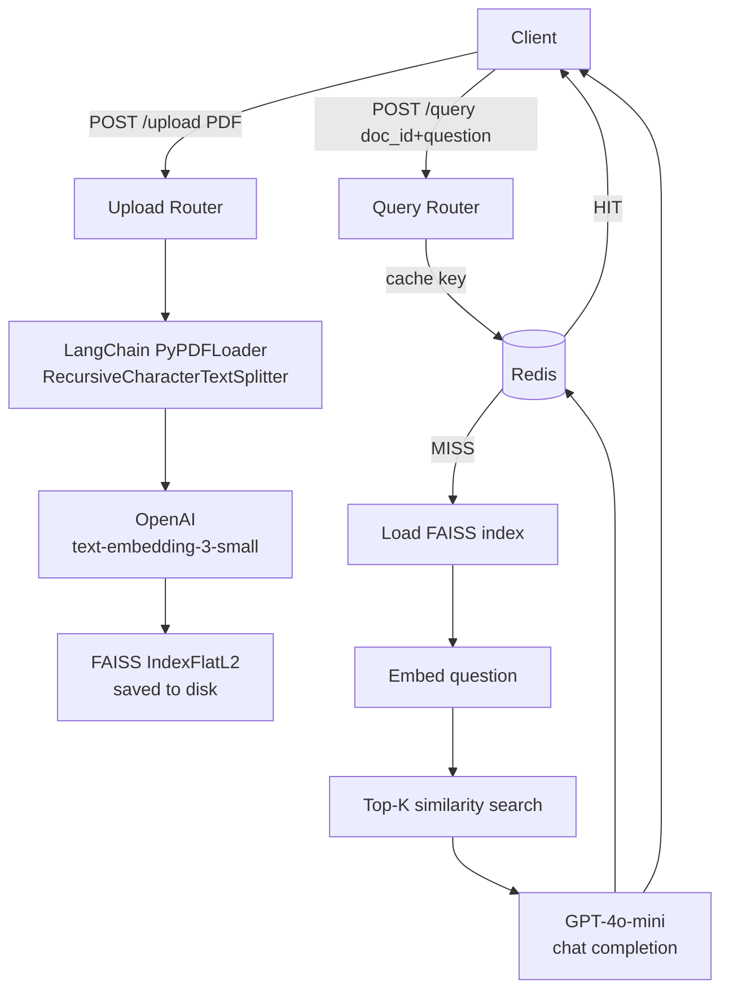

# RAG Document Q&A API

A production-quality FastAPI service that lets users upload PDF documents and ask natural-language questions about them, powered by a retrieval-augmented generation (RAG) pipeline built on OpenAI, FAISS, and Redis — fully async from ingestion to response.

---

## Architecture

```
┌──────────────┐     POST /upload        ┌─────────────────────────────────────────────┐
│              │ ──────────────────────► │                                             │
│   Client     │                         │  FastAPI (async)                            │
│              │ ◄────────────────────── │                                             │
│              │     { doc_id }          │  ┌──────────┐  ┌──────────┐  ┌──────────┐ │
│              │                         │  │ chunker  │  │ embedder │  │  FAISS   │ │
│              │     POST /query         │  │(LangChain│─►│ (OpenAI  │─►│  index   │ │
│              │ ──────────────────────► │  │PyPDFLoad)│  │embed-3-s)│  │(on disk) │ │
│              │                         │  └──────────┘  └──────────┘  └──────────┘ │
│              │ ◄────────────────────── │                                    │        │
│              │  { answer, sources,     │  ┌──────────┐  ┌──────────┐       │        │
│              │    cached, latency_ms } │  │  Redis   │  │  GPT-4o  │◄──────┘        │
└──────────────┘                         │  │  cache   │  │   mini   │                │
                                         │  └──────────┘  └──────────┘                │
                                         └─────────────────────────────────────────────┘
```

### Mermaid version



---

## How It Works (RAG Pipeline)

1. **Ingest** — The uploaded PDF is parsed page-by-page with LangChain's `PyPDFLoader` and split into overlapping chunks using `RecursiveCharacterTextSplitter`.
2. **Embed** — Each chunk is converted into a 1536-dimension float vector via OpenAI's `text-embedding-3-small` model, batched to respect rate limits.
3. **Index** — Vectors are stored in a `faiss.IndexFlatL2` index and persisted to disk alongside the raw chunk texts, keyed by the SHA-256 hash of the uploaded file.
4. **Retrieve** — At query time, the question is embedded with the same model, and the top-K most similar chunks are retrieved from the FAISS index via L2 distance search.
5. **Generate** — Retrieved chunks are injected as context into a structured prompt sent to `gpt-4o-mini`, which is instructed to answer only from the provided context.

---

## Setup

### Prerequisites

- Python 3.10+
- Redis running locally (or via Docker)
- An OpenAI API key

### 1. Clone and install

```bash
git clone https://github.com/your-username/rag-qa-api.git
cd rag-qa-api
python -m venv .venv
source .venv/bin/activate          # Windows: .venv\Scripts\activate
pip install -r requirements.txt
```

### 2. Configure environment

```bash
cp .env.example .env
# Edit .env and set your OPENAI_API_KEY
```

### 3. Start Redis

```bash
# Docker (recommended)
docker run -d -p 6379:6379 redis:7-alpine

# or Homebrew on macOS
brew services start redis
```

### 4. Run the API

```bash
uvicorn app.main:app --reload --host 0.0.0.0 --port 8000
```

Visit `http://localhost:8000/docs` for the interactive Swagger UI.

---

## API Reference

### `POST /api/v1/upload`

Upload a PDF document for indexing.

**Request** — `multipart/form-data`

| Field | Type | Description |
|-------|------|-------------|
| `file` | PDF file | Max 10 MB |

**Example**

```bash
curl -X POST http://localhost:8000/api/v1/upload \
  -F "file=@./my_document.pdf"
```

**Response**

```json
{
  "doc_id": "3a7f2c1e9b...",
  "chunks_count": 47,
  "status": "indexed"
}
```

---

### `POST /api/v1/query`

Ask a question about an indexed document.

**Request** — `application/json`

| Field | Type | Description |
|-------|------|-------------|
| `doc_id` | string | ID returned from `/upload` |
| `question` | string | Natural-language question |

**Example**

```bash
curl -X POST http://localhost:8000/api/v1/query \
  -H "Content-Type: application/json" \
  -d '{"doc_id": "3a7f2c1e9b...", "question": "What is the main conclusion?"}'
```

**Response**

```json
{
  "answer": "The main conclusion is that renewable energy investment...",
  "sources": [
    "...chunk text used as context...",
    "...another relevant passage..."
  ],
  "cached": false,
  "latency_ms": 1243.7
}
```

---

### `GET /health`

```bash
curl http://localhost:8000/health
```

```json
{
  "status": "ok",
  "timestamp": "2025-01-15T10:30:00+00:00"
}
```

---

## Performance Notes

**Caching** — Redis caches `(doc_id, question) → answer` for 1 hour by default (`CACHE_TTL_SECONDS`). Cached responses skip FAISS lookup, embedding, and LLM calls entirely — typical latency drops from ~2 s to under 5 ms.

**Latency tracking** — Every `/query` response includes `latency_ms` measured end-to-end with `time.monotonic()`, covering cache lookup, embedding, retrieval, and generation.

**Batching** — The embedder batches chunks in groups of 100 with a 100 ms inter-batch pause, balancing throughput against OpenAI rate limits.

**Deterministic doc_id** — The doc_id is a SHA-256 hash of the file contents, so uploading the same file twice reuses the existing index and cache entries without redundant API calls.

---

## Running Tests

```bash
pytest tests/ -v
```

## Running the Profiler

Ensure the API server is running on port 8000, then:

```bash
python scripts/profile_query.py path/to/sample.pdf
```

Results are printed to stdout and saved to `profile_results.txt`.

---

## Project Structure

```
rag-qa-api/
├── app/
│   ├── main.py              # App factory, lifespan, CORS, router registration
│   ├── config.py            # Pydantic BaseSettings
│   ├── models.py            # Request/response schemas
│   ├── routers/
│   │   ├── upload.py        # POST /api/v1/upload
│   │   └── query.py         # POST /api/v1/query
│   ├── services/
│   │   ├── chunker.py       # PDF loading + text splitting
│   │   ├── embedder.py      # OpenAI batch embedding with retries
│   │   ├── vector_store.py  # FAISS build/save/load/search
│   │   ├── llm.py           # GPT-4o-mini chat completion
│   │   └── cache.py         # Async Redis cache helpers
│   └── utils/
│       └── logger.py        # Structured logger factory
├── tests/
│   ├── test_upload.py
│   └── test_query.py
├── scripts/
│   └── profile_query.py
├── .env.example
├── requirements.txt
└── README.md
```

---

## Known Gotchas

- **Redis must be running** before starting the app — the lifespan handler connects on startup.
- **FAISS index directory** (`./faiss_indexes` by default) is created automatically; ensure the process has write permission.
- **OpenAI key scope** — `text-embedding-3-small` and `gpt-4o-mini` must be enabled on your key/org.
- **pypdf vs pdfminer** — `PyPDFLoader` uses `pypdf` under the hood; scanned/image-only PDFs will produce empty text. Use `UnstructuredPDFLoader` for OCR support.
- **pytest-asyncio mode** — tests use `@pytest.mark.asyncio`; add `asyncio_mode = "auto"` to `pytest.ini` or `pyproject.toml` to avoid decorating every test function.
